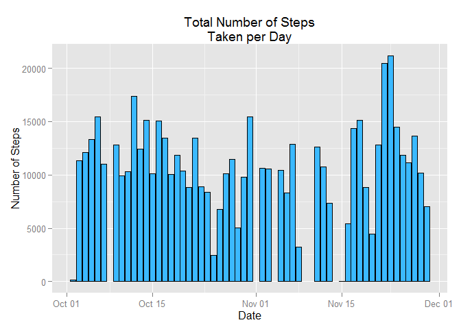

# PA1_template

Reproducible Research Peer Assignment 1
=======================================

The data for this assignment are available from here
https://d396qusza40orc.cloudfront.net/repdata%2Fdata%2Factivity.zip
       (save to your working directory)

The zip file contains one file: "activity.csv"

Install requered packages


```r
library(ggplot2)
library(timeDate)
```


Set file path, read data, convert to data frame

```r
file <- 'activity.csv'
data <- read.csv(file)
df <- data.frame(data)
```


Format Date

```r
df$date <- as.Date(df$date, "%F")
```

1: What is mean total number of steps taken per day? (ignore the missing values in the dataset)
-----------
- a. Calculate the total number of steps taken per day.


```r
xSumPerDay <- aggregate(steps ~ date, df, sum)
```

- b. Make a histogram of the total number of steps taken each day.


```r
p1 <- ggplot(xSumPerDay, aes(x=date, y=steps)) +
        geom_histogram(stat='identity', fill='#3BB9FF', colour='black') +
        ggtitle('Total Number of Steps\nTaken per Day') +
        xlab('Date') +
        ylab('Number of Steps')
p1
```

 

  
- c. Calculate and report the mean and median of the total number of steps taken per day


```r
paste("The Mean for Steps taken on all Days is", mean(xSumPerDay$steps, na.rm=TRUE))
```

```
## [1] "The Mean for Steps taken on all Days is 10766.1886792453"
```

```r
paste("Median of Steps taken on all Days is", median(xSumPerDay$steps, na.rm=TRUE))
```

```
## [1] "Median of Steps taken on all Days is 10765"
```

  
2: What is the average daily activity pattern?
-----------

- a. Make a time series plot (i.e. type = "l") of the 5-minute interval (x-axis) and the average number of steps taken, averaged across all days (y-axis)


```r
xMeanPerInterval <- aggregate(steps ~ interval, data=df, mean)
```


```r
ggplot(xMeanPerInterval, aes(interval,steps)) +
  geom_line(colour='#FF0000') +
  ggtitle('Average Steps Taken Across All Days') +
  xlab('5 Minute Intervals of Day') +
  ylab('Number of Steps')
```

 

- b. Which 5-minute interval, on average across all the days in the dataset, contains the maximum number of steps?


```r
max_interval <- xMeanPerInterval$interval[which(
  xMeanPerInterval$steps == max(xMeanPerInterval$steps))]
```


```r
paste("The interval with the max steps is", max_interval)
```

```
## [1] "The interval with the max steps is 835"
```

Part 3: Imputing missing values
---
a. Note that there are a number of days/intervals where there are missing values (coded as NA). The presence of missing days may introduce bias into some calculations or summaries of the data. Calculate and report the total number of missing values in the dataset (i.e. the total number of rows with NAs)


```r
sumMissing <- sum(is.na(df$steps))
```


```r
paste("The sum of missing entries for steps is", sumMissing)
```

```
## [1] "The sum of missing entries for steps is 2304"
```

- c. Devise a strategy for filling in all of the missing values in the dataset. The strategy does not need to be sophisticated. For example, you could use the mean/median for that day, or the mean for that 5-minute interval, etc. Create a new dataset that is equal to the original dataset but with the missing data filled in.


```r
df1 <- df
df1$id <- 1:nrow(df1)
dfMerge <- merge(df1, xMeanPerInterval, by="interval")
dfMerge <- dfMerge[order(dfMerge$id), ]
naIndex <- which(is.na(df1$steps))
df1[naIndex, 'steps'] <- dfMerge[naIndex, 'steps.y']
```

- d. Make a histogram of the total number of steps taken each day and Calculate and report the mean and median total number of steps taken per day. Do these values differ from the estimates from the first part of the assignment? What is the impact of imputing missing data on the estimates of the total daily number of steps?


```r
ggplot(df1, aes(date,steps)) +
  geom_histogram(stat='identity', fill='blue', colour='blue') +
  ggtitle('Total Number of Steps\nTaken Each Day') +
  xlab('Date') +
  ylab('Number of Steps')
```

 

- e. Calculate and report the mean and median of the total number of steps taken per day


```r
xSumPerDay1 <- aggregate(steps ~ date, df1, sum)
```


```r
paste("The Mean for Steps taken per Days is", mean(xSumPerDay1$steps, na.rm=TRUE))
```

```
## [1] "The Mean for Steps taken per Days is 10766.1886792453"
```

```r
paste("Median of Steps taken per Day is", median(xSumPerDay1$steps, na.rm=TRUE))
```

```
## [1] "Median of Steps taken per Day is 10766.1886792453"
```


Question 4: Are there differences in activity patterns between weekdays and weekends?
--------
a. For this part the weekdays() function may be of some help here. Use the dataset with the filled-in missing values for this part. Create a new factor variable in the dataset with two levels - "weekday" and "weekend" indicating whether a given date is a weekday or weekend day.


```r
df1['dayOfWeek'] <- NA

for (i in 1:nrow(df1)) {
  if (weekdays(df1$date[i]) %in% c("Saturday","Sunday")) {
    df1$dayOfWeek[i] = "weekend"
  } else {
    df1$dayOfWeek[i] = "weekday"
  }
}
```

- b. Make a panel plot containing a time series plot (i.e. type = "l") of the 5-minute interval (x-axis) and the average number of steps taken, averaged across all weekday days or weekend days (y-axis). See the README file in the GitHub repository to see an example of what this plot should look like using simulated data.


```r
xMeanPerDayType <- aggregate(steps ~ interval + dayOfWeek, df1, mean)
```


```r
ggplot(xMeanPerDayType, aes(x=interval, y=steps, group=dayOfWeek)) +
  geom_line(colour='red') +
  facet_grid(dayOfWeek ~ .) +
  xlab("5 Minute Intervals")
```

 
